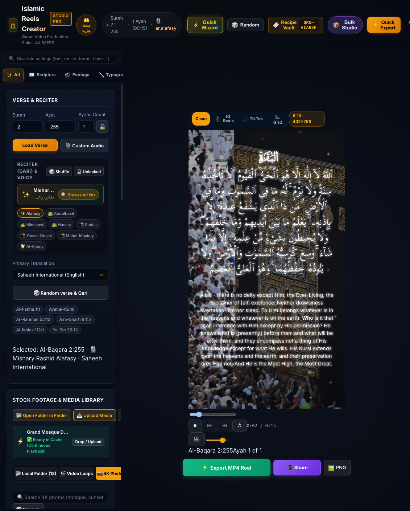
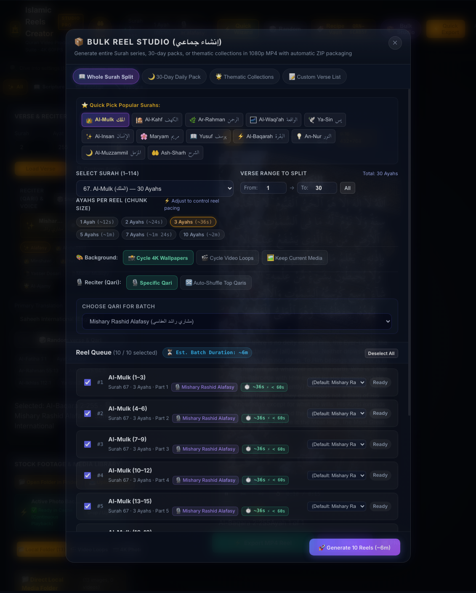
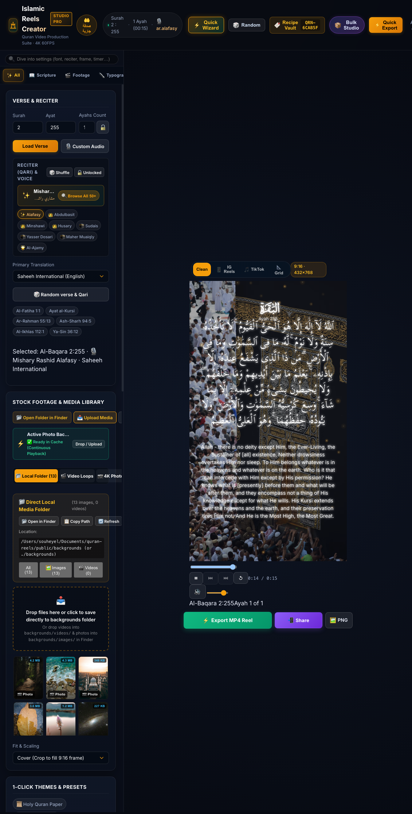
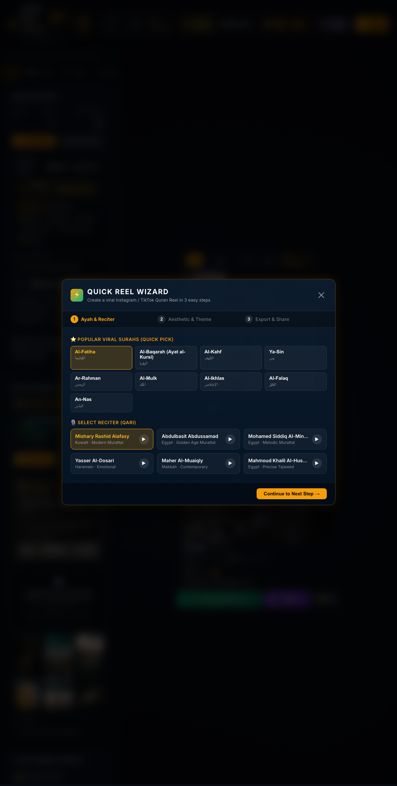

# Islamic Reels Creator (Studio & Mobile App) 🎬📖✨

> **بِسْمِ ٱللَّهِ ٱلرَّحْمَٰنِ ٱلرَّحِيمِ**  
> ﴿ وَذَكِّرْ فَإِنَّ الذِّكْرَىٰ تَنفَعُ الْمُؤْمِنِينَ ﴾  
> *“And remind, for indeed, the reminder benefits the believers.”* — Surah Adh-Dhariyat (51:55)

---

## 🤲 App Bio & Dedication — Sadaqah Jariyah (صدقة جارية إن شاء الله)

> **قال رسول الله ﷺ:**  
> **«إِذَا مَاتَ ابْنُ آدَمَ انْقَطَعَ عَمَلُهُ إِلَّا مِنْ ثَلَاثٍ: صَدَقَةٍ جَارِيَةٍ، أَوْ عِلْمٍ يُنْتَفَعُ بِهِ، أَوْ وَلَدٍ صَالِحٍ يَدْعُو لَهُ»**  
> *(صحيح مسلم)*
>
> *The Messenger of Allah ﷺ said: “When a human being dies, their deeds come to an end except for three: an ongoing charity (Sadaqah Jariyah), beneficial knowledge, or a righteous child who prays for them.”* — (Sahih Muslim 1631)

**Islamic Reels Creator** is created purely for the sake of Allah ﷻ as an ongoing charity (**Sadaqah Jariyah**). It empowers every Muslim, content creator, and seeker of truth to produce breathtaking, studio-grade Quran video reels for **Instagram Reels, TikTok, YouTube Shorts, and WhatsApp Status** with ease, beauty, and reverence.

May Allah accept this humble endeavor from everyone who builds, reads, recites, designs, creates, and shares these sacred verses.

---

## 📸 Visual Showcase

<div align="center">
  
  <p><em>Studio Workspace: Live Canvas Preview, Word-by-Word Sub-Ayah Karaoke Glow, Real-Time Spectrogram, and Studio Inspector</em></p>
</div>

<br/>

| Bulk Reel Studio (Format 1 Manifest) | Direct Local Backgrounds Folder |
| :---: | :---: |
|  |  |
| *Automated batch creation with master manifest.json* | *1-click Finder opening, drag-and-drop disk save & live scanning* |

<br/>

<div align="center">
  
  <p><em>3-Step Quick Reel Wizard: Viral Surahs, Master Reciter Selection, and Instant Export</em></p>
</div>

---

## 🌟 What's New in Recent Updates

### 📦 1. Bulk Reel Studio & Master `manifest.json` Archive
Generate entire Surah series, 30-day packs, or thematic collections in seconds:
- **Whole Surah Split**: Automatically chunks long or short Surahs into optimal reel lengths (1 to 10 Ayat per video).
- **Format 1 Master `manifest.json` Structure**: Videos sit at the root of the ZIP alongside a comprehensive manifest containing full Arabic & English titles, authentic virtues, Ayah numbers, reciters, and contextual hashtags for seamless social automation:

```text
quran_reels_pack.zip
├── manifest.json
├── 01_kahf_verses_1_10.mp4
├── 02_maryam_verses_1_15.mp4
└── 03_rahman_verses_1_25.mp4
```

```json
[
  {
    "filename": "01_kahf_verses_1_10.mp4",
    "title": "سورة الكهف | آيات 1-10",
    "description": "تلاوة خاشعة عطرة بصوت القارئ مشاري العفاسي من سورة الكهف المباركة.\n\nفضل قراءة سورة الكهف يوم الجمعة أضاء له من النور ما بين الجمعتين.",
    "surah": 18,
    "surahName": "Al-Kahf",
    "ayah": "1 - 10",
    "reciter": "Mishary Rashid Alafasy",
    "hashtags": ["#القرآن", "#سورة_الكهف", "#تلاوة"]
  }
]
```

### 📁 2. Direct Local Backgrounds & Videos Folder Access
- **Direct Local Disk Folders**: Store your own 4K wallpapers and drone motion loops in `./backgrounds/images` and `./backgrounds/videos` (symlinked directly to `public/backgrounds`).
- **1-Click Finder Integration**: Click **"📂 Open in Finder"** in the Studio to instantly reveal your local media directory.
- **In-Browser Drag & Drop**: Drop files straight into the browser to stream them directly to your disk folder.
- **Live Auto-Scanning**: Vite dev server scans disk additions live without needing server restarts.
- **Batch Export Integration**: Bulk Reel Studio automatically cycles through your local media library during automated exports.

### ⚡ 3. Quick Reel Wizard
A rapid 3-step creation flow for beginners and fast creators:
1. **Ayah & Reciter**: Pick from popular viral Surahs (Al-Mulk, Al-Kahf, Ar-Rahman, Ayat al-Kursi, etc.) or enter custom verses.
2. **Aesthetic Theme**: Choose curated presets (Golden Medina, Royal Cordoba, Sacred Grove, Holy Quran Paper).
3. **Export & Share**: 1-click generation ready for mobile distribution.

### 🧪 4. Recipe Engine & Preset Vault
- **Recipe Codes**: Share and fork your exact typography, background, particle, and audio visualizer setups with compact codes (e.g. `QRN-6CAB5F`).
- **Generation History**: Automatically snapshots every creation so you never lose a design.
- **URL Deeplinking**: Open the app with `?recipe=...` to load preconfigured themes instantly.

### 📜 5. Holy Quran Paper & Mushaf Layout Mode
- Authentic Mushaf layout mode rendering classic Quranic script with parchment textures, traditional margins, and authentic Hizb/Juz markers.

### 🚀 6. Cloudspace Disk Exports & Bulk Uploader CLI Hub
Designed specifically for creators running on cloudspaces (Codespaces, cloud servers, or local machines):
- **Direct Server Disk Exports**: Batch exports automatically save directly to `./exports/<pack_name>/` on the server filesystem alongside `manifest.json`, eliminating the need to download large ZIP files to your laptop and re-upload.
- **Ready-to-Use CLI Command**: Each export generates a 1-click copyable terminal command:
  ```bash
  python scripts/bulk_uploader.py --folder "exports/quran_pack_kahf_20260905_1200"
  ```
- **Custom Script Templates**: Configure your own CLI command pattern (e.g. `python upload.py --dir {folder}` or `node uploader.js`), automatically saved to `localStorage`.
- **Included Starter CLI Script (`scripts/bulk_uploader.py`)**: Built-in Python CLI tool that parses Format 1 master `manifest.json`, validates video files, and connects to social media distribution pipelines.

---

## 🌟 Core Features

### 📱 Native Android App (Official APK Release)
- **Direct Download**: 📥 **[Download Quran Reels Creator APK v1.0.0 (7.48 MB)](https://github.com/souheyell/quran-reels/releases/download/v1.0.0/quran-reels-creator.apk)**
- **Official Release Page**: 🏷️ **[GitHub Releases v1.0.0](https://github.com/souheyell/quran-reels/releases/tag/v1.0.0)**
- Standalone installable Android APK with full GPU hardware acceleration, WebCodecs 60FPS video rendering, 50+ Qaris, and native Android Filesystem storage & Share sheet integration.

---

### 🌟 1-Click Aesthetic Themes & Presets
Instant, professional styling configurations tailored for high engagement on social platforms:
- **🌟 Golden Medina**: Deep amber calligraphy, glowing fireflies, gilded arabesque frame, resonant spectrum bars, cinematic zoom.
- **🌌 Midnight Reflection**: Cool cyan/silver glow, Amiri Quran font, gentle falling snow, cinematic vignette, fluid sine wave.
- **🌿 Sacred Grove**: Crisp white Naskh, sunbeam dust motes, misty redwood forest canopy, voice pulse line, ascending tilt.
- **👑 Royal Cordoba**: Majestic Reem Kufi calligraphy, Moorish royal arch, starry dots matrix, Andalusian elegance.
- **🏜️ Desert Twilight**: Warm sand glow, Tajawal font, Andalusian geometric frame, spectrum bars, meditative breathing pulse.
- **🖤 Minimalist Dark**: Sleek monochrome, modern Cairo font, lower-third layout, clean canvas.
- **📜 Holy Quran Paper**: Authentic warm Mushaf page texture with gold leaf embellishments.

---

### ✨ Ultra-Smooth Continuous Karaoke Glow
- **Fluid Sub-Word Interpolation**: As the Qari recites each word, Arabic calligraphy illuminates with a continuous Hermite cosine light transition rather than harsh stepping.
- **Blooming Golden Flare**: Active words bloom with a soft radiating flare (`#ffd700` or custom color), while upcoming words stay delicately dimmed for maximal engagement and contemplation.

---

### 🎨 Authentic Islamic Arabesque Frames & Gilded Borders
- **🌟 Gilded Arabesque Corners**: Intricate Ottoman floral leaf scrollwork and 8-pointed star rosettes framing the video corners.
- **🕌 Andalusian Geometric Double Frame**: Classical double gold inlay lines punctuated with Rub el Hizb rosettes.
- **👑 Moorish Royal Arch**: Majestic horseshoe arch canopy framing the sacred Surah title and Ayah text.
- **🎬 Cinematic Vignette**: Smooth feathered radial gradient drawing the viewer's focus to the center holy calligraphy.
- Fully customizable frame color and opacity.

---

### 🌊 Voice Audio Spectrum & Waveform Visualizer
- **📊 Symmetric Bars**: Symmetrical vertical frequency spectrum bars pulsing in harmonic resonance with the Qari's voice.
- **🌊 Glowing Wave**: Fluid sine-modulated bezier curve with soft ambient glow.
- **⚡ Voice Pulse Line**: Clean horizontal presence line with central vocal envelope heartbeat spike.
- **✨ Radiant Dots Matrix**: Matrix of glowing harmonic particles vibrating rhythmically.
- Fully deterministic in real-time preview and 1080p 60fps MP4 export.

---

### 🎙️ 25+ Golden-Age & Contemporary Master Reciters (Qaris)
High-speed, sample-accurate audio recitations directly from the EveryAyah CDN:

#### 👑 Golden Age Classical Masters (كبار قراء العصر الذهبي)
- **Mahmoud Khalil Al-Husary** (Murattal & Mujawwad) — الشيخ محمود خليل الحصري
- **Abdulbasit Abdussamad** (Murattal & Mujawwad) — الشيخ عبد الباسط عبد الصمد
- **Mohamed Siddiq Al-Minshawi** (Murattal & Mujawwad) — الشيخ محمد صديق المنشاوي
- **Mustafa Ismail** — الشيخ مصطفى إسماعيل
- **Mohammad Mahmoud Al-Tablawi** — الشيخ محمد محمود الطبلاوي
- **Mahmoud Ali Al-Banna** — الشيخ محمود علي البنا
- **Ali Hajjaj Al-Suwaisi** — الشيخ علي حجاج السويسي
- **Ali Jaber (Former Imam of Masjid Al-Haram)** — الشيخ علي جابر
- **Muhammad Ayyub (Former Imam of Masjid An-Nabawi)** — الشيخ محمد أيوب
- **Ali Al-Hudhaify (Madinah Imam)** — الشيخ علي الحذيفي
- **Ibrahim Al-Akhdar** — الشيخ إبراهيم الأخضر

#### 🕌 Contemporary Masters & Haram Imams (أئمة الحرمين وكبار القراء)
- **Mishary Rashid Alafasy** — الشيخ مشاري راشد العفاسي
- **Abdulrahman Al-Sudais (Imam of Masjid Al-Haram)** — الشيخ عبد الرحمن السديس
- **Saud Al-Shuraim** — الشيخ سعود الشريم
- **Yasser Al-Dossari (Imam of Masjid Al-Haram)** — الشيخ ياسر الدوسري
- **Maher Al-Muaiqly (Imam of Masjid Al-Haram)** — الشيخ ماهر المعيقلي
- **Nasser Al-Qatami** — الشيخ ناصر القطامي
- **Abu Bakr Al-Shatri** — الشيخ أبو بكر الشاطري
- **Saad Al-Ghamdi** — الشيخ سعد الغامدي
- **Fares Abbad** — الشيخ فارس عباد
- **Hani Ar-Rifai** — الشيخ هاني الرفاعي
- **Salah Al-Budair (Madinah Imam)** — الشيخ صلاح البدير

---

### 🎥 7 Cinematic Camera Motion Presets (Ken Burns)
- **Ken Burns Zoom In**: Smooth, slow push-in towards the calligraphy centerpiece.
- **Ken Burns Zoom Out**: Expansive reveal pulling back from the scene.
- **Horizontal Pan**: Gentle cinematic glide from left to right.
- **Ascending Tilt**: Slow upward drift towards the heavens.
- **Diagonal Glide**: Dynamic diagonal pan with subtle scale.
- **Contemplative Pulse**: Rhythmic, meditative breathing zoom.
- **Static**: Crisp, motionless frame.

---

### ❄️ 5 Atmospheric Particle Effects
- **Fireflies / Embers**: Floating glowing particles with warm breathing pulse.
- **Slow Snow**: Gentle falling flakes with horizontal air drift.
- **Sunbeam Dust Motes**: Golden ambient micro-particles floating in sunlight.
- **Twinkling Night Stars**: Subtle glistening celestial field.
- **Gentle Rain**: Diagonal rain streaks for contemplative Quran verses.

---

### 🚀 Hardware-Accelerated 1080p 60FPS Video Export
- **Off-screen Canvas Pipeline**: Frame-by-frame rendering with backpressure control (<50MB RAM).
- **Audio Mixing**: High-fidelity stereo AAC audio multiplexed directly in the browser/app via WebCodecs/MediaRecorder.
- Instant single-frame **4K PNG snapshot download**.

---

## 🛠️ Technology Stack
- **Framework**: React 19 + TypeScript + Vite + Capacitor
- **Mobile Engine**: Native Android WebView (Capacitor) with hardware acceleration
- **Rendering Engine**: Canvas 2D with sub-pixel interpolation & Hermite curve smoothing
- **Video & Audio**: WebCodecs / MediaRecorder API + Web Audio API
- **Styling**: Vanilla CSS tokens (Dark theme, glassmorphism, responsive mobile layout)
- **Testing**: Vitest + Oxlint (112 automated test suites)

---

## 🚀 Getting Started

### Prerequisites
- Node.js (v18 or higher)
- npm or pnpm
- Android SDK (optional, for building native Android APK)

### Installation
```bash
git clone https://github.com/souheyell/quran-reels.git
cd quran-reels
npm install
```

### Development Server (Web)
```bash
npm run dev
```
Open [http://localhost:5173](http://localhost:5173) in your browser.

### Adding Custom Backgrounds Directly
Place your custom wallpapers and video loops into:
```bash
# Images:
./backgrounds/images/
# Videos:
./backgrounds/videos/
```
Or click **"📂 Open in Finder"** in the **Local Folder** tab of the Studio.

### Run Automated Tests
```bash
npm run test
```

### Build Production Bundle
```bash
npm run build
```

### Build Android APK
```bash
npm run build:apk
```
The compiled APK will be generated at:
`./quran-reels-creator.apk`

---

## 📄 License & Dedication
Open-source under the [MIT License](LICENSE). Built for Quran Dawah, spiritual reflection, and educational purposes as a **Sadaqah Jariyah (صدقة جارية إن شاء الله)**.
